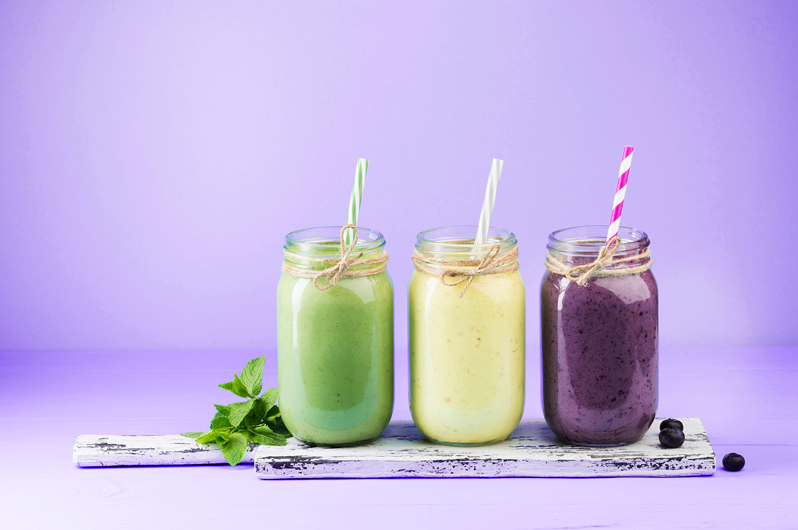

# Exercise 1

One of these:
- banana
- apple
- others
  1. grapes
  2. lemons
  3. pineapples

## Task A

This is the [Enjoy Image](images/enjoy.png)
  

Very looooong loooong
 single line.

Line 1,  
Line 2,  
Line 3.

1.
now, we want to add area5
width: 1200;, so 100%,
height: 287;,
in this case it would also be top: 2713px;, but i dont think that matters since we always want it to stick to the bottom of the page.
we want here padding 32px.
we need it to always stick to the bottom.

1.1.
we have
who we are
width: 126;
height: 126;

1.1.1.
who we are
height: 28px;
font-family: Nunito;
font-weight: 700;
font-size: 18px;
line-height: 28px;
letter-spacing: 0%;
text-transform: uppercase;

1.1.2.
About
Team
Work With Us
i gues this is a kind of list, for each-
hight: 22px;
font-family: Nunito;
font-weight: 400;
font-size: 16px;
line-height: 100%;
letter-spacing: 0%;
and there needs to be a 16px gap above the text item.

1.2.
under
who we are block we have an unorginized list of 3 icons. each icon has height 20px, the width wont be distorted.

1.3.
under the icons we have a block of text-
width: 198;
height: 18;

© 2024 SMOOTHIES

font-family: Nunito;
font-weight: 600;
font-size: 16px;
line-height: 100%;
letter-spacing: 0%;

1.4.
another 150px to the right of who we are block we have another block-
follow us
width: 107;
height: 126;

1.4.1.
FOLLOW US
height: 28px;
font-family: Nunito;
font-weight: 700;
font-size: 18px;
line-height: 28px;
letter-spacing: 0%;
text-transform: uppercase;

1.4.2.
Twitter
Facebook
Instagram
i gues this is a kind of list, for each-
hight: 22px;
font-family: Nunito;
font-weight: 400;
font-size: 16px;
line-height: 100%;
letter-spacing: 0%;
